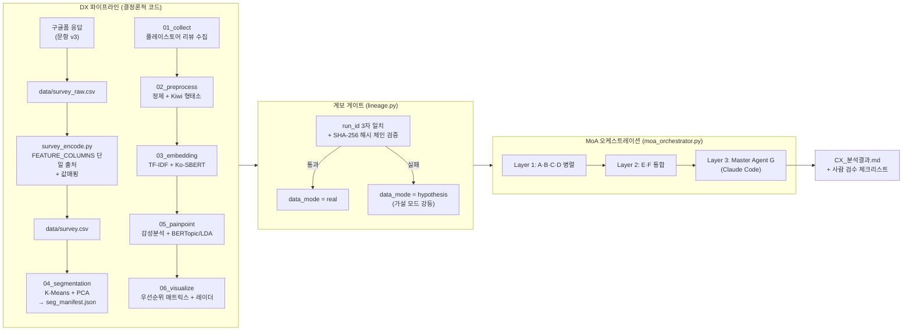
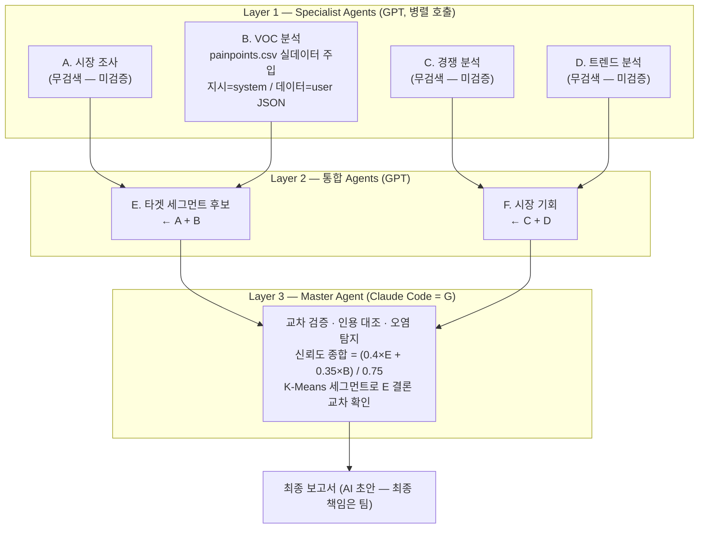
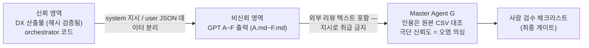
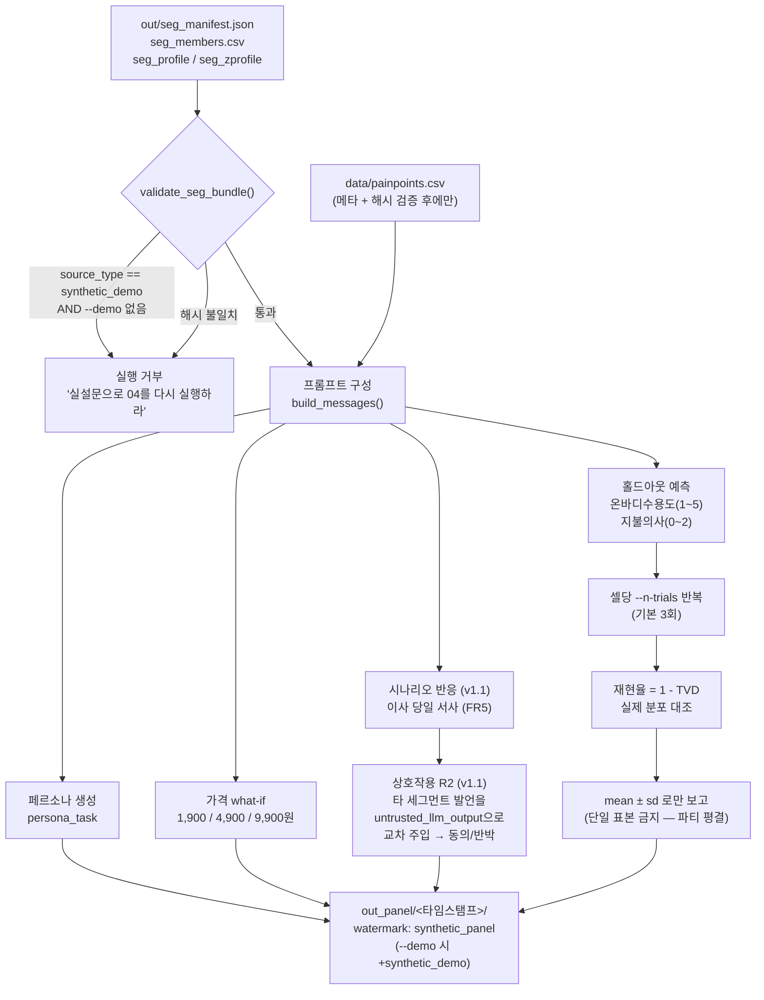
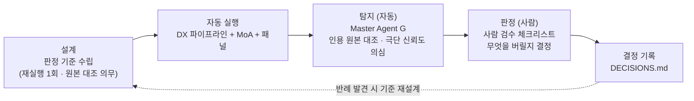

# 워크플로우 다이어그램 — DX 파이프라인 + MoA 오케스트레이션 + ThinQ Village

> 보고서 삽입용. 실제 구현(v2.9) 기준으로 작성 — 개념도가 아니라 코드와 1:1 대응.
> 렌더링: Obsidian·GitHub에서 Mermaid 자동 렌더링됨.
>
> v2.9 변경: 설문 인코딩 경로(`survey_encode.py`)와 ThinQ Village 합성패널
> (`synthetic_panel.py`) 추가. **§5 신설 — 이 문서의 결론부이자 발표의 중심 주장**
> (AI 오케스트레이션 + 사람 판정). §1~§4는 §5를 뒷받침하는 구조 설명이다.

## 1. 전체 구조 (DX → AX 2단 구조)

## 2. MoA 3-Layer 상세 (에이전트별 역할·데이터 신뢰 등급)

## 3. 신뢰 경계 (prompt injection 방어 관점)

## 4. ThinQ Village — 합성패널 (synthetic_panel.py v1.1)

설문 응답자를 LLM 페르소나로 확장해 **홀드아웃 문항으로 자기검증**하고 가격 what-if,
시나리오 반응(이사 당일), 세그먼트 간 상호작용 2라운드를 돌리는 단계. 04가 v2.9에서 새로 내놓는 `seg_manifest.json`·`seg_members.csv`가
게이트의 전제라서, 04가 v2.9 미만이면 패널은 실행 자체가 되지 않는다.

**설계상 의도된 제약 (발표 시 설명 포인트)**

| 장치 | 내용 | 왜 |
|---|---|---|
| 홀드아웃 제외 | 문12 온바디수용도·문13 지불의사를 페르소나 조련 입력에서 뺌 | 답을 알려주고 맞히게 하면 검증이 아니다 |
| 걱정_원문 인용 제외 | 문13-1 자유응답을 프롬프트에 넣지 않음 | 홀드아웃 정답 누설 경로 |
| mean ± sd 강제 | 셀당 3회 시행, 단일 표본 보고 금지 | LLM 출력 분산이 재현율만큼 크다 |
| 이중 워터마크 | `--demo` 경로 산출물에 `synthetic_panel+synthetic_demo` | 데모 숫자가 발표 자료로 새는 것 차단 |
| `out_panel/` 격리 | gitignore, `survey.csv`와 절대 병합 안 함 | 합성 응답이 실측으로 승격되는 사고 방지 |

## 5. AI 오케스트레이션 — 이 프로젝트의 핵심 주장

> ### AX를 진짜로 하려니, 강의 원안의 도구로는 부족했다.
>
> 강의 AX 가이드라인은 **"ML/DL 직접 코딩(DX) → 전문 에이전트 위임 + 사람은 설계·검증(AX)"**.
> 우리는 이 원칙을 말로만이 아니라 **실행 가능한 게이트**로 만들려 했고,
> 그 과정에서 원안의 도구 일부를 바꿔야 했다. 아래는 그 이탈의 근거와 결과다.

### 5.1 증거 — 사람이 AI를 잡은 4건

먼저 결과부터. MoA를 실제로 돌렸더니 **에이전트 출력에서 오류 4건이 나왔고, 전부 원본 대조로
적발됐다.** 원문 기록: `docs/final-output/CX_분석결과.md`.

| # | AI가 낸 것 | 무엇이 틀렸나 | 사람이 내린 결정 |
|---|---|---|---|
| 1 | B: "신뢰도 85% (내부 데이터 분석, 2023)" | **존재하지 않는 출처.** 재실행에서 같은 가짜 출처를 달고 수치만 95%로 상승 | 재실행 1회 허용 규칙을 세우고, 재불량 확인 후 **종합점수 산출 자체를 포기**. 단 B의 인용 10건은 원본 대조 통과 → 사실 데이터는 유효, 기각된 것은 자기 신뢰도 평가뿐 |
| 2 | E: "김민수 35세 IT 직장인 두 자녀" → 재실행 "김영희 40세 전업주부 서울" | 리뷰 컬럼은 `review/rating/date/likes` 4개뿐 — **인구통계가 데이터에 없다.** A의 미검증 표현이 E에서 사실로 굳는 오염 경로 확인 | 인구통계 폐기, 실측 신호(밤/새벽 7.6%·아기 1.7%)만으로 **Night Keeper** 잡 기반 페르소나 재정의. 인구통계는 설문 검증 대기로 **비워 둠** |
| 3 | P-3 Pain 규모 (LDA 자동 분류) | 자동 분류 0.5% vs 눈검수 6.2% — **12배 괴리** | 눈검수 6.2%를 주 수치로 채택, LDA 0.5%는 각주 병기 |
| 4 | F: "상호운용성이 시장 기회" | 입력 C·D가 검색 없이 생성된 미검증 데이터 | 전략 근거에서 **강등**, "게이트가 미검증 입력을 걸러낸 사례"로 성격 변경 |

**이 4건의 성격 — 자동화된 것과 사람이 한 것의 구분**

> **탐지는 자동화했고, 그 결과 무엇을 버릴지는 사람이 정했다.
> 규칙을 세운 것도, 점수를 포기하기로 결정한 것도 사람이다.**

1차 적발은 Master Agent G의 교차 검증(인용 원본 대조·극단 신뢰도 의심)이 수행한다 — 즉
탐지 레이어는 자동이다. 그러나 "재실행 1회를 허용하되 재불량이면 산출 불가로 확정한다"는
**규칙의 수립**, 그리고 실제로 **종합점수를 포기한 결정**은 사람의 몫이었다.
이것이 강의 AX 정의("사람은 설계·검증")에 정확히 대응한다 — 사람이 한 일은 분석이 아니라
**판정 기준의 설계와 폐기 결정**이다.

검증하는 시늉만 했다면 85%든 95%든 그대로 실었을 것이다. **숫자 하나를 버렸다는 사실**이
게이트가 장식이 아니라는 증거다.

### 5.2 그래서 바꾼 것 — 설계 원칙과 그 귀결

위 4건이 가능하려면 **오케스트레이션이 특정 성질을 갖고 있어야** 했다. 그 요구가 원안의
도구 선택을 바꿨다. 왼쪽이 우리가 세운 원칙이고, 오른쪽은 그 원칙 때문에 원안에서 달라진 지점이다.

| 우리가 세운 원칙 | 원안 대비 무엇이 달라졌나 |
|---|---|
| **계보는 감사 가능해야 한다** — 검증 로직 자체가 버전 관리돼야 "누가 언제 무엇을 바꿨나"에 답할 수 있다 | 1단계 에이전트 수집을 Make.com이 아닌 `moa_orchestrator.py`로. GUI 시나리오는 diff가 남지 않는다 |
| **전처리는 재현 가능해야 한다** — 같은 입력에 같은 출력이 나와야 해시 체인이 성립한다 | LLM 전처리 대신 Kiwi 형태소(결정론적 코드). 요약 품질을 재현성과 맞바꾼 선택 |
| **AI 출력은 신뢰 경계 밖이다** | 원안에 없던 **계보 게이트**와 **ThinQ Village 홀드아웃 자체검증**을 추가 (§3·§4) |
| **미검증은 미검증으로 남긴다** | A·C·D는 검색 도구가 없어 미검증 — 지우거나 보정하지 않고 **'(미검증 — 조사 필요)' 표기를 최종 보고서까지 유지**. 레이더 차트 입력 `cx_scores.csv`도 C의 미검증 점수를 **넣지 않기로 결정** |

원안 그대로 구현한 부분은 그대로다 — 3-Layer MoA 구조(A~D 병렬 → E·F 통합 → Master G, §2),
신뢰도 가중 공식 `(0.4×E + 0.35×B) / 0.75`, 에이전트 토픽 분석(`05_painpoint`).
**가중 공식은 구현돼 있으나 이번 회차에는 산출하지 않았다** — B가 입력 자격을 잃었기 때문이고,
이것이 §5.1의 1번 사례다.

### 5.3 남긴 것

**Consensus 투표 메커니즘은 미구현이다.** 에이전트 간 다수결로 결론을 수렴시키는 장치로,
초안 품질을 올리는 기능이지 위 주장의 전제는 아니다 — 우리 주장은 "AI가 초안을 내고 사람이
판정한다"이고 그 루프는 Consensus 없이도 작동함을 §5.1이 보인다. 다음 반복 대상.

*(A·C·D 미검증과 `cx_scores.csv`는 갭이 아니라 §5.2의 네 번째 원칙이 적용된 결과다.)*

**남은 갭**: ① A·C·D의 MCP/검색 데이터 접근(현재 전부 미검증 표기) ② Consensus 투표
③ 레이더 차트 입력 `cx_scores.csv` — **C 에이전트의 미검증 5축 점수를 넣지 말 것**

## 보고서 스토리 포인트 (REMEMBER 반영)

1. **AI 결과는 초안** — 계보 게이트가 실데이터 여부를 시스템이 보장, 미검증 수치는 표기 유지
2. **최종 책임은 사람** — Layer 3 뒤에 사람 검수 체크리스트가 항상 마지막 게이트
3. **재사용 자산** — SERVICE·APP_ID·FEATURE_COLUMNS 3개 값만 바꾸면 다른 서비스 분석에 그대로 재사용
