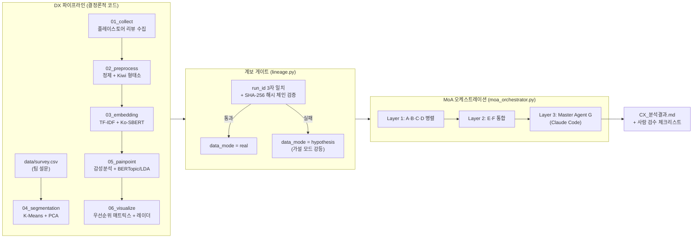
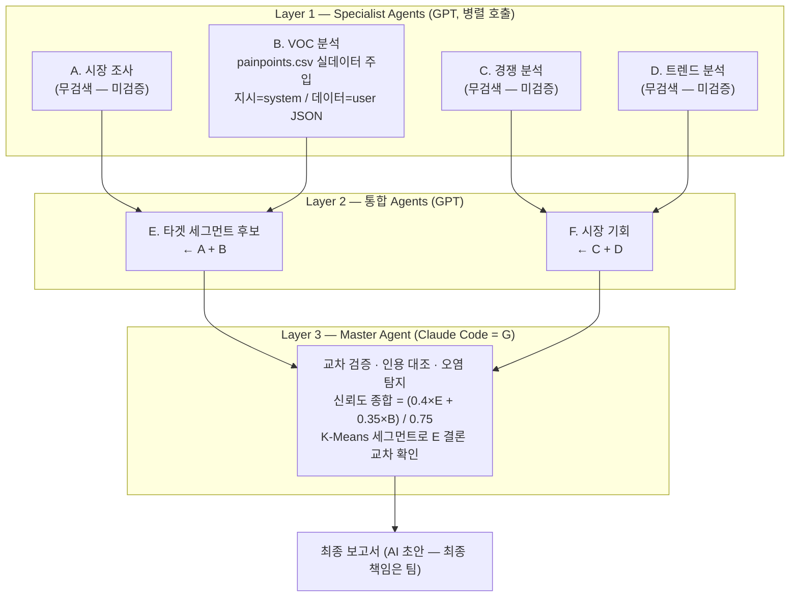
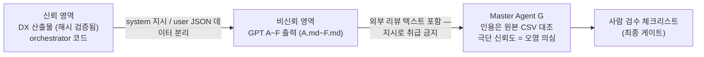

# 워크플로우 다이어그램 — DX 파이프라인 + MoA 오케스트레이션

> 보고서 삽입용. 실제 구현(v2.8) 기준으로 작성 — 개념도가 아니라 코드와 1:1 대응.
> 렌더링: Obsidian·GitHub에서 Mermaid 자동 렌더링됨.

## 1. 전체 구조 (DX → AX 2단 구조)

## 2. MoA 3-Layer 상세 (에이전트별 역할·데이터 신뢰 등급)

## 3. 신뢰 경계 (prompt injection 방어 관점)

## 보고서 스토리 포인트 (REMEMBER 반영)

1. **AI 결과는 초안** — 계보 게이트가 실데이터 여부를 시스템이 보장, 미검증 수치는 표기 유지
2. **최종 책임은 사람** — Layer 3 뒤에 사람 검수 체크리스트가 항상 마지막 게이트
3. **재사용 자산** — SERVICE·APP_ID·FEATURE_COLUMNS 3개 값만 바꾸면 다른 서비스 분석에 그대로 재사용
