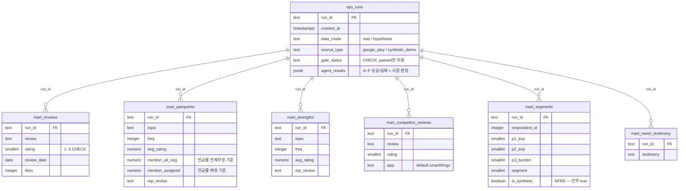

# 객체 정의서 & ERD — ThinQ OnMe

작성 2026-08-06 (파티) · 산출물 특강 요구 산출물 8번 (마지막).

> **AI 초안 — 최종 책임은 팀.** ⚠️ 소급 작성.
> [SYSTEM_ARCHITECTURE §1](SYSTEM_ARCHITECTURE.md)의 두 시스템 구분이 여기에도 적용된다 —
> **제품(A)에는 RDB가 없고, 발견 트랙(B)에만 있다.** 이 문서는 그 둘을 정직하게 나눠 싣는다.

---

## 1. 시스템 A — 제품 객체 정의 (홈 프로필)

**제품에는 ERD가 없다 — 서버 DB가 없기 때문이다. 이 부재가 결함이 아니라 주장이다**
(P-3: 프로필이 서버에 있으니 계정·개인정보가 강제된다 → 서버가 원본을 안 가지면 강제할 근거가 없다).

제품의 유일한 데이터 객체는 **온바디 홈 프로필** — 워치에 사는 키-값 구조다.
정본: [PROFILE_SCHEMA.md](../PROFILE_SCHEMA.md) v1.0.0. 요약:

| 항목 | 정의 |
|---|---|
| 소재 | 워치(캐리어 중립) — 원본 유일, 서버 사본 없음 |
| 구조 | 키-값 (스키마 검증 통과분만 저장) |
| 크기 제약 | **키당 4,096B · 총 128KB** — 전송 제약(Connect IQ)이 구조를 결정 |
| 식별자 차단 | `FORBIDDEN_KEY_FRAGMENTS` — lat/lon·"owner" 등 **구조적으로 저장 불가** (FR7, 구현·테스트됨) |
| 예약 필드 | `reserved_wellness` — 예약이자 **금지**(의료 규제, NFR5). 스키마에 자리만 있고 쓰지 않는다 |
| 버전 | 스키마 버전 필드 + 마이그레이션 규약 (PROFILE_SCHEMA §3) |
| 표시층 분리 | 별칭("안방 에어컨")은 프로필 밖 — 프로필이 아는 것은 `d1`뿐 |

> 심사 예상 질문 **"DB 설계는요?"** 답변:
> "제품에는 서버 DB가 없습니다 — 그 부재가 설계입니다. 데이터 모델은 워치 안의
> 프로필 스키마이고, 검증·크기 예산·금지 키가 전부 코드로 강제되며 테스트 426건에
> 포함돼 있습니다. RDB가 실재하는 곳은 분석 파이프라인 쪽이고, 그 ERD는 별도로 있습니다."

## 2. 시스템 B — 발견 트랙 ERD (실재하는 유일한 RDB)

정본: [db/schema.sql](../../db/schema.sql) (Epic 5, PostgreSQL·Docker 로컬).
원칙: **게이트 하류** — 검증 실패 데이터는 이 DB에 존재하지 않는다
(`gate_status CHECK = 'passed'`가 스키마 수준에서 강제).

### 객체(테이블) 정의

| 테이블 | 역할 | 비고 |
|---|---|---|
| `ops.runs` | 실행 이력 — **전 테이블의 FK 부모.** 시계열·run 간 비교의 축 | 적재 계약: 통과한 run만 들어온다 — 실패 run을 넣고 거르지 않는다 |
| `mart.reviews` | 정제 리뷰 (12,585건 적재 실증) | 컬럼 = 수집 4종 + 파생 — 인구통계 컬럼 자체가 없다(페르소나 날조 기각의 물적 근거) |
| `mart.painpoints` | Pain 토픽 | **언급률 두 기준 병기**가 컬럼 수준에 박혀 있음(CLAUDE.md v2.2) |
| `mart.strengths` | 강점 토픽 | 선택 편향 방어 3종 중 하나의 원천 |
| `mart.competitor_reviews` | 대조군(SmartThings) | P-2 2.0배의 원천 |
| `mart.segments` | 세그먼트 | ⚠️ **`is_synthetic` 전부 true** — 실설문이 오지 않았고 이제 오지 않는다(NDA). 합성 패널 산출물임이 컬럼으로 명시됨 |
| `mart.naver_testimony` | 네이버 정성 증언 | P-2 심층·경쟁 담론 전용 |

> **`mart.segments` 주의**: 설문 트랙 종료로 이 테이블은 영구히 `is_synthetic=true`다.
> 분석 입력으로 쓰지 않는다 — 파이프라인 검증 이력으로만 남는다
> ([SURVEY_TRACK_CLOSURE](../SURVEY_TRACK_CLOSURE.md)).

## 3. 관련 문서

[PROFILE_SCHEMA](../PROFILE_SCHEMA.md)(제품 객체 정본) · [db/schema.sql](../../db/schema.sql)(ERD 정본) ·
[SYSTEM_ARCHITECTURE](SYSTEM_ARCHITECTURE.md)(7번) — **산출물 특강 요구 목록 0~8번 전체 완주 (2026-08-06)**
