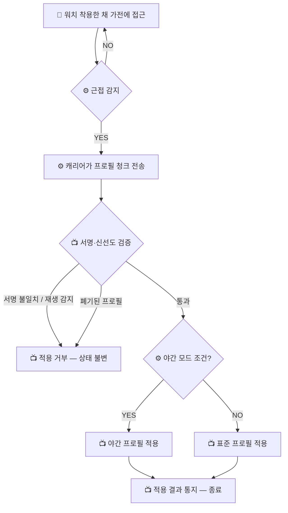
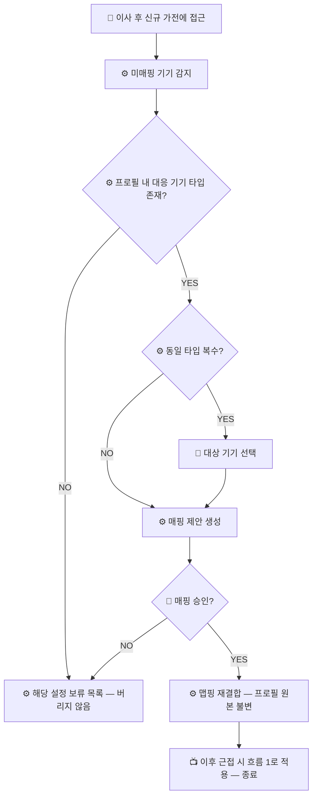
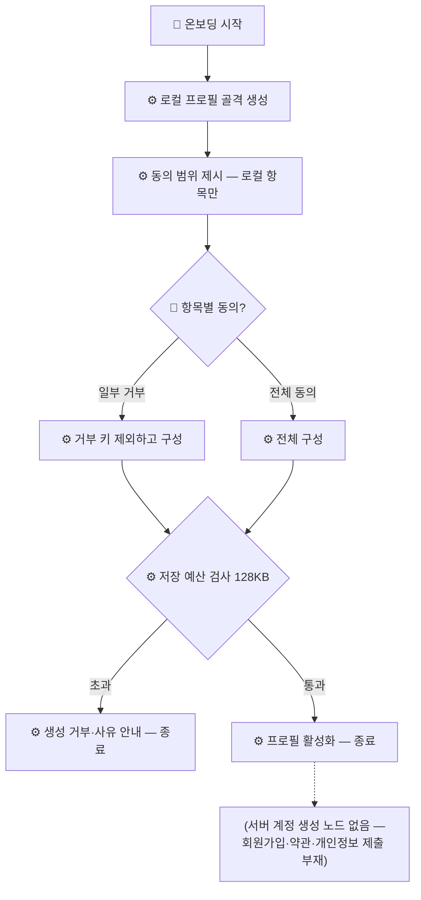

# 서비스 흐름도 — ThinQ OnMe

작성 2026-08-06 (파티) · 산출물 특강 요구 산출물 4번 · p.26 원칙 준수
(핵심 기능만·사용자/시스템/외부 구분·YES/NO 분기·Mermaid).

> **AI 초안 — 최종 책임은 팀.** ⚠️ 소급 작성 — 흐름은 데모 코드 실동작에서 역추출.
> [ARCHITECTURE_FLOW](../ARCHITECTURE_FLOW.md)(코드 층 구조)와 다른 문서다 —
> 이쪽은 **사용자 관점** 흐름이다. 범례: 🙂 사용자 행동 / ⚙️ 시스템 처리 / 📺 가전(외부·시뮬레이터).

핵심 흐름 3개만 그린다 — Pain 하나당 하나 (P-1 → 근접 적용, P-2 → 이주, P-3 → 온보딩).

---

## 1. 근접 프로필 적용 — P-1 반박 (UC-003, `demo_night`)

**대비점: 기존 구조는 "앱 실행→로그인→서버 응답 대기"가 선행하고 서버 장애 시 전체 불능.
이 흐름에는 그 경로 자체가 없다.**

> **이 흐름 어디에도 서버·클라우드·로그인 노드가 없다.** 오프라인 강제 환경에서
> 네트워크 호출 0건으로 실증([OFFLINE_EVIDENCE](../OFFLINE_EVIDENCE.md)).

## 2. 이주 재결합 — P-2 반박 (UC-004, `demo_relocate`)

> **재등록·재가입 노드가 없다.** "핸드폰 초기화하고 재설치하니 제품이 전부 없어짐"(P-2
> 대표 인용)의 구조적 반대.

## 3. 무계정 온보딩 — P-3 반박 (UC-001, `demo_onboard`)

---

**그리지 않은 것**: 폐기·복구(UC-005)와 다인 병행(UC-006)은 흐름 1의 검증 분기와 include
관계로 충분히 표현됨. 전 기능 흐름도화는 p.26 원칙("핵심 기능만") 위반이라 하지 않는다.

다음 산출물: [메뉴구조도](MENU_STRUCTURE.md)(5번)
