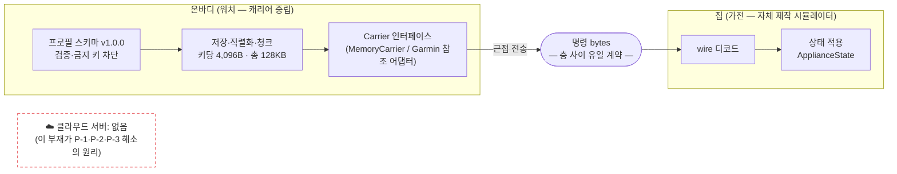
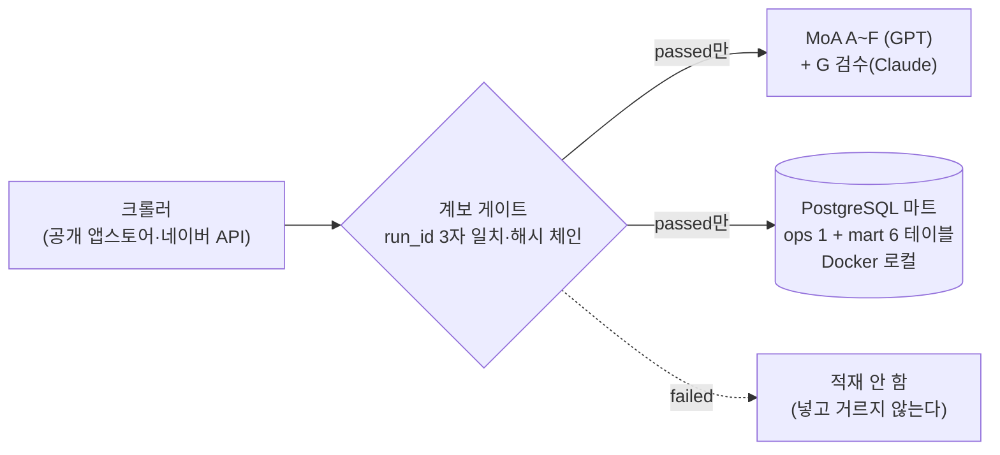

# 시스템 아키텍처 구조도 — ThinQ OnMe

작성 2026-08-06 (파티) · 산출물 특강 요구 산출물 7번.
코드 수준 층 구조·역류의 정본은 [ARCHITECTURE_FLOW](../ARCHITECTURE_FLOW.md) —
이 문서는 그것을 **시스템 구성 관점**으로 재편성한 것이다.

> **AI 초안 — 최종 책임은 팀.** ⚠️ 소급 작성.
> ARCHITECTURE_FLOW는 커밋 `acdb984`(07-23) 기준이라 "P-2 코드·데모 0" 표기가 낡았다
> — 이후 Epic 3~4 완료(demo_relocate·demo_revoke 등, 426 passed). 역류 1건(loopback.py:53
> `reassemble` import)은 **현존** — 시뮬레이터가 코어의 검증 함수를 재사용하는 의도된
> 계약이며 주석으로 문서화돼 있다.

---

## 1. 시스템이 두 개다 — 섞어 읽지 말 것

| 시스템 | 정체 | 서버 | 성숙도 |
|---|---|---|---|
| **A. 제품 (처방 트랙)** | ThinQ OnMe 온바디 홈 프로필 | **없음 — 부재가 주장** | PoC / TRL 3~4 |
| **B. 발견 트랙 (분석 도구)** | VOC 수집·분석 파이프라인 + MoA + PostgreSQL 마트 | 로컬 Docker DB | TRL 5~6 — **발표 본선 #17 "일하는 방식"**([승격 2026-08-07](../DECISIONS.md)) |

B는 A를 만들기 위한 도구이지 A의 일부가 아니다. B의 DB를 보고 "서버 있네"라고
읽으면 오독 — **A에는 어떤 서버도 없다.**

## 2. 시스템 A — 제품 아키텍처

- **유일 계약 = 명령 bytes.** 온바디 층과 가전 층은 bytes로만 만난다 — 벤더 API가
  코어에 새지 않는다(NFR-004, 경계 테스트 통과)
- **오프라인 강제 검증**: `offline_guard`가 실행 중 네트워크 호출을 감시 — 증거 2종
- **미구현 경계 (정직 표기)**: BLE 실전송(TRL 2 동결 — 현재 loopback/시뮬레이터 전송) ·
  워치 앱(Monkey C 미착수) · 제품 UI(손목 1장 스케치만)

## 3. 시스템 B — 발견 트랙 (발표 본선 #17 — "일하는 방식")

게이트 하류 원칙: **검증을 통과하지 못한 데이터는 DB에 존재하지 않는다.**
상세: [db/schema.sql](../../db/schema.sql) · ERD는 [ERD·객체 정의서](ERD_OBJECT_SPEC.md).

## 4. 관련 문서

[ARCHITECTURE_FLOW](../ARCHITECTURE_FLOW.md)(코드 수준 정본) · [CARRIER_INTERFACE](../CARRIER_INTERFACE.md) ·
[OFFLINE_EVIDENCE](../OFFLINE_EVIDENCE.md) · [MATURITY_POSITION](../MATURITY_POSITION.md) ·
다음 산출물: [ERD·객체 정의서](ERD_OBJECT_SPEC.md)(8번)
