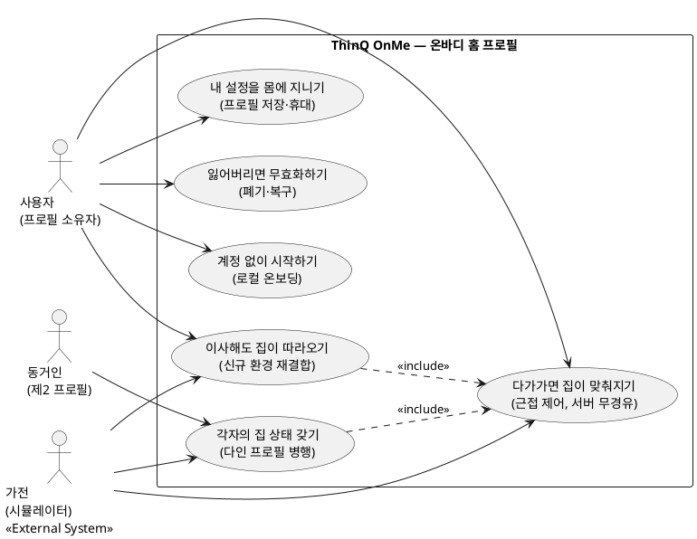
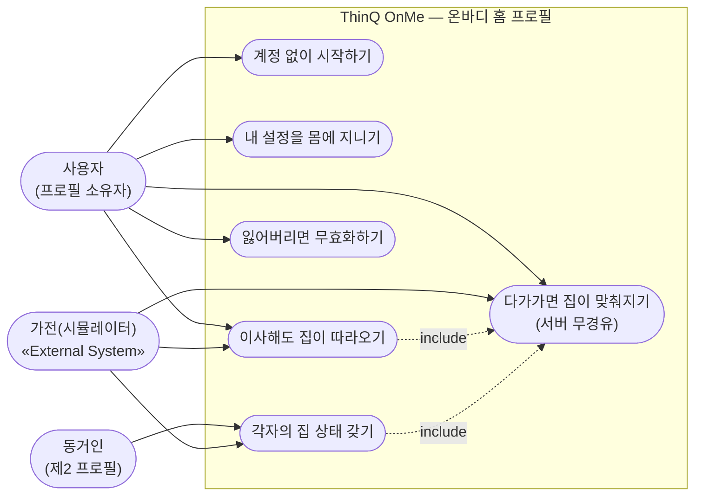

# 유스케이스 다이어그램 — ThinQ OnMe "Home Follows You"

작성 2026-08-06 (파티) · 산출물 특강 요구 산출물 1번 · 작성법 p.11 준수
(사용자 목표 단위만, 세부 동작 제외, include/extend 최소).

> **AI 초안 — 최종 책임은 팀.**
>
> ⚠️ **소급 작성** — 구현(데모 10종·426 passed)이 먼저였고 다이어그램이 나중이다
> ([PRD_MVP](PRD_MVP.md)와 동일 경위). 유스케이스는 지어낸 것이 아니라 **구현된
> 데모·FR에서 역추출**했다 — 각 유스케이스에 근거 데모를 표기한다.

---

## 1. 액터

| 액터 | 구분 | 설명 |
|---|---|---|
| **사용자** (프로필 소유자) | 사람 | 워치에 홈 프로필을 지닌 사람. T1 Night Keeper가 대표 잡 |
| **동거인** (제2 프로필 소유자) | 사람 | 같은 집, 자기 워치·자기 프로필 (Quietly Home — T2 가설이나 **기능 자체는 구현·데모됨**) |
| **가전** | 외부 시스템 | 프로필을 읽어 상태를 맞추는 상대. **현재 자체 제작 시뮬레이터** — 실기기 아님(정직 표기) |

**액터가 아닌 것** — 워치: 프로필이 사는 곳으로 **시스템 경계 안**이다(캐리어 중립층 포함).
클라우드 서버: **이 시스템에 존재하지 않는다.** 그 부재가 제품의 주장이다.

## 2. 다이어그램 (PlantUML — 정본)

### 렌더 근사 (Mermaid — 열람용, 정본 아님)

## 3. 유스케이스 ↔ 근거 매핑 (역추출 출처)

| 유스케이스 | FR | Pain | 근거 데모 (구현 완료) |
|---|---|---|---|
| 계정 없이 시작하기 | FR-4 | P-3 | `demo_onboard` (Story 4.1) |
| 내 설정을 몸에 지니기 | FR-1 | P-2 | 프로필 코어 (Epic 1, 스키마 v1.0.0) |
| 다가가면 집이 맞춰지기 | FR-2 | P-1 | `demo_night` (Story 2.4 — 발표 클라이맥스) |
| 이사해도 집이 따라오기 | FR-3 | P-2 | `demo_relocate` (Story 3.2) |
| 잃어버리면 무효화하기 | FR-5 | 신뢰 전제 | `demo_revoke` (Story 4.4) |
| 각자의 집 상태 갖기 | FR-6 | P-2·T2 | `demo_quietly` |

## 4. 제외한 것 (자료 p.11 원칙)

**세부 동작이라 제외**: 프로필 키 검증, 크기 예산 체크, 청크 전송, 캐리어 핸드셰이크,
릴레이 방어(`demo_relay` — NFR이지 사용자 목표 아님), 오프라인 강제(`offline_guard` —
검증 장치이지 유스케이스 아님).

**사용자 목표가 아니라서 제외**: 회원가입·로그인 — **이 시스템에는 존재하지 않는 것이
설계 목표다** (다른 팀 다이어그램과의 의도된 차이. 자료 예시 Able Band에는 있음).

**미구현이라 제외**: 워치 화면 조작(워치 앱 미착수), 실기기 BLE 페어링(TRL 2 동결).
다이어그램의 UC는 전부 시뮬레이터 환경 데모 기준이다.

## 5. 관련 문서

[PRD_MVP](PRD_MVP.md)(0-1) · [epics.md](epics.md)(구현 단위) ·
[DEMO_SCRIPT](../DEMO_SCRIPT.md)(데모 7장면) · 다음 산출물: 유스케이스 명세서(2번)
